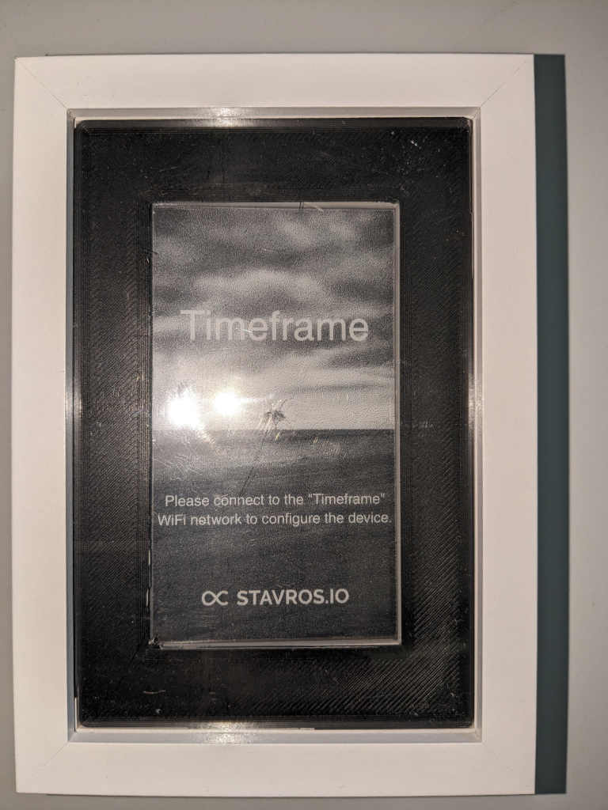
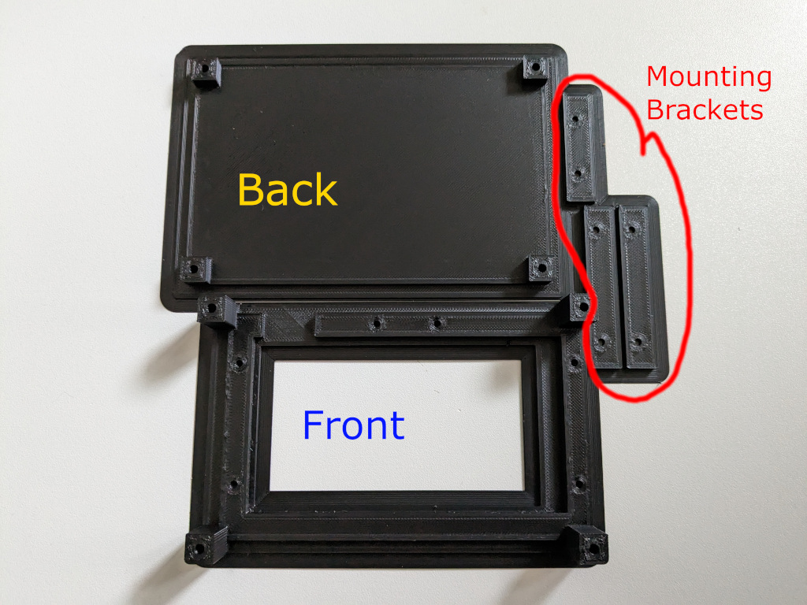
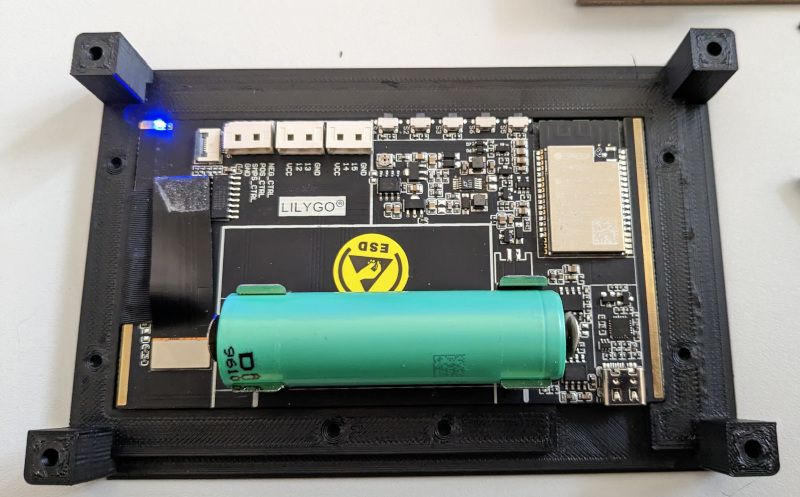
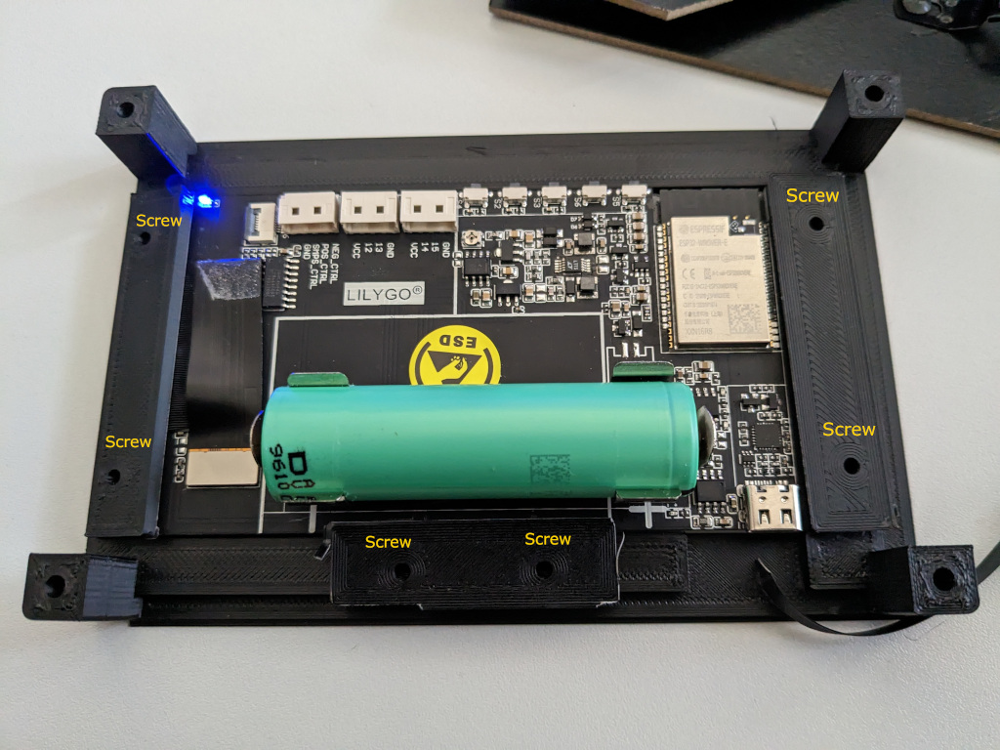
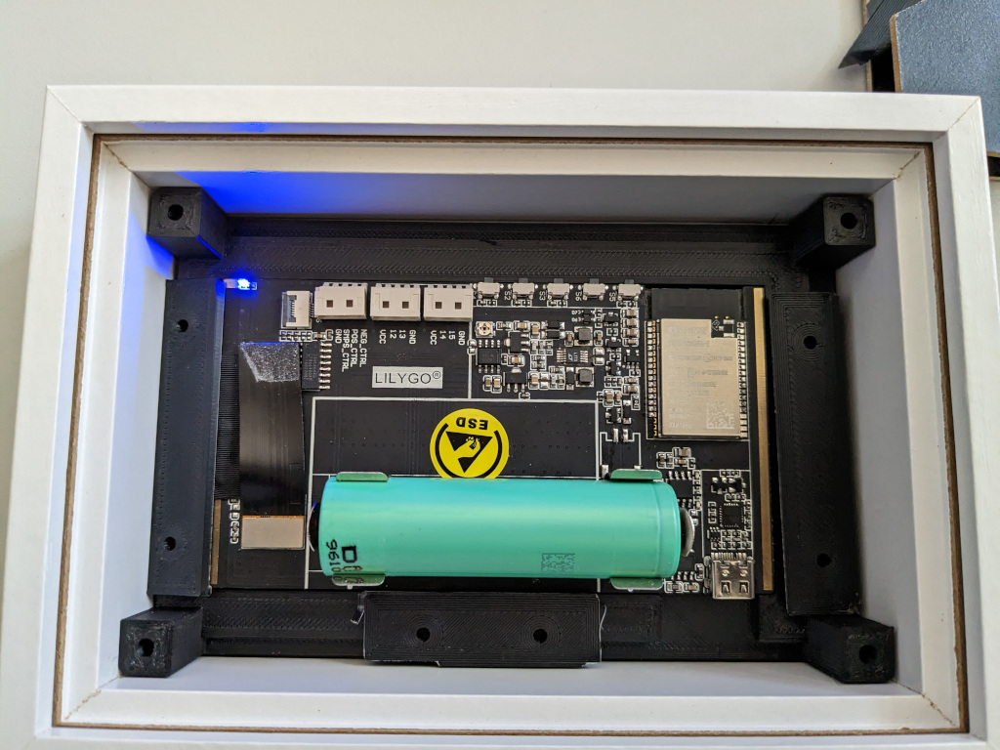
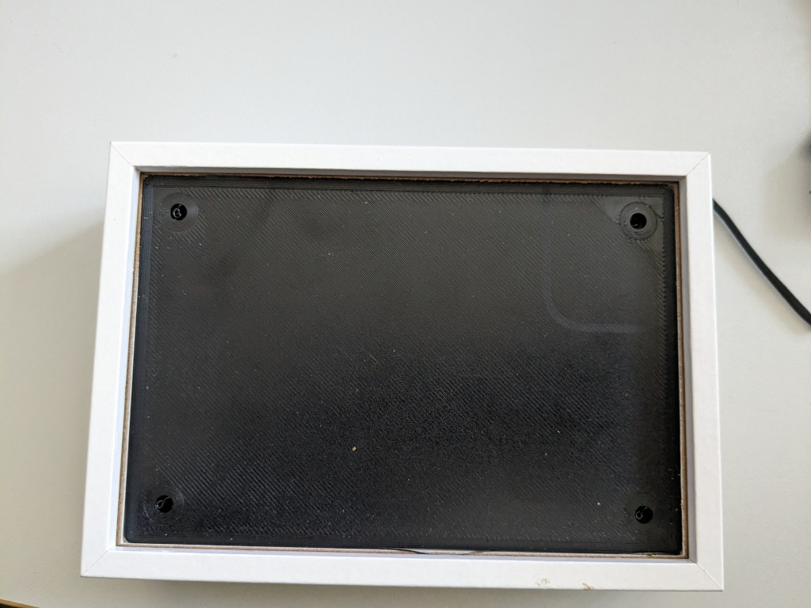

# frameForTimeframe
Mounting the Lilygo T5 4.7" Into a Cheap Frame

These are some 3D-printable insets for a cheap picture frame from Amazon.

The frame is: https://www.amazon.de/Anhow-Bilderrahmen-Objektrahmen-Transparente-Acrylplatte/dp/B0BGNYG5ZQ/

## Printed Parts:
There's six parts:
- Front
- Back
- Three mounting brackets  

## Step 1: 
Put the display into the front part. 

## Step 2 (optional if 18650 battery is used):
Mount the brackets using 2,9x6,5 mm sheet metal screws.

## Step 3:
Put it into the frame. Please note: I didn't place the screws, yet (optional, if you have a battery). 

## Step 4:
Put the back cover on.

